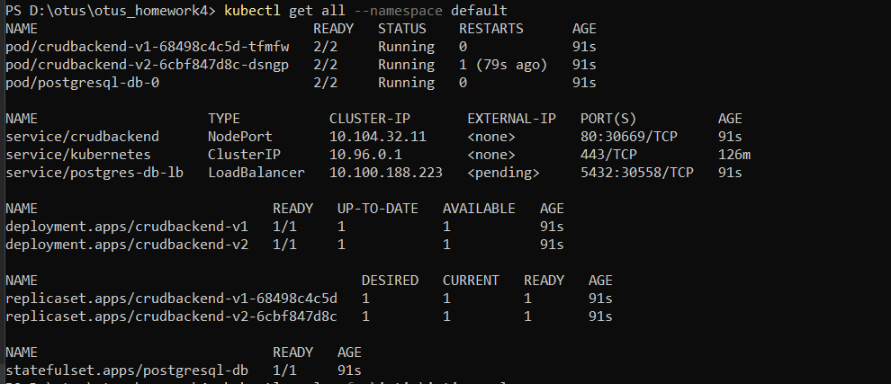
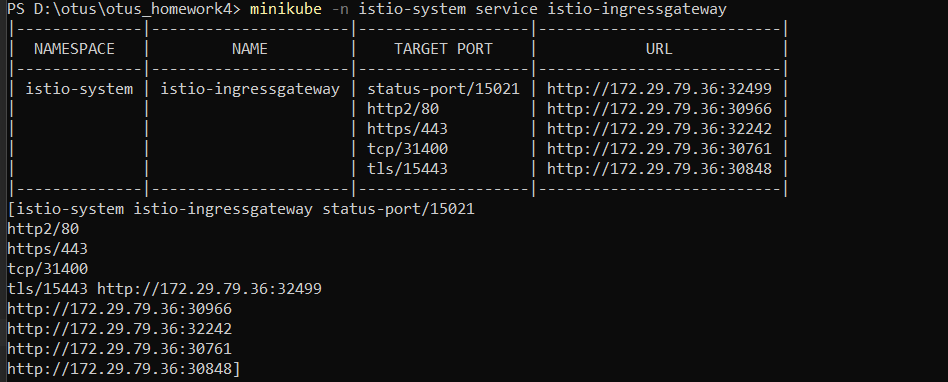
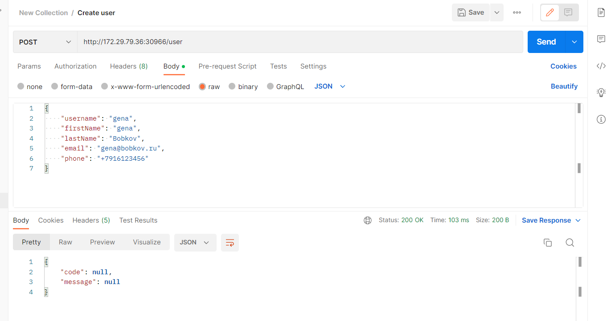
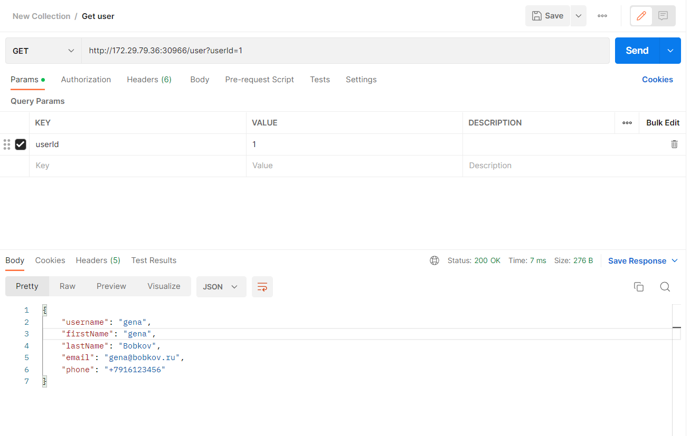
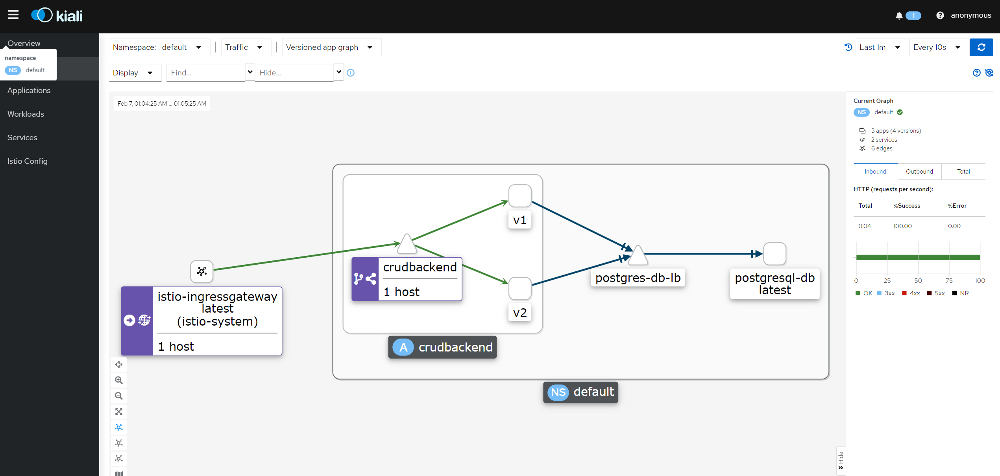

# Домашнее задание #4
## Развернуть в кластере две версии приложения и настроить балансировку трафика между ними

## Установка компонентов
### Установить istioctl.
### Добавить необходимые репозитории в Helm:

### Istio
Установить Istio:
```
istioctl install --set profile=demo -y
kubectl label namespace default istio-injection=enabled
```

### Application
Установить приложение
```
helm upgrade --install crudapp .\crud-chart
```
### Проверка
```
kubectl get all --namespace default
```


### Istio Services
Установить объекты Istio
```
kubectl apply -f .\istio\istio.yaml
```
Проверить, что все ок
```
istioctl analyze
```
### Kiali
Установить Kiali:
```
kubectl apply -f kiali
kubectl rollout status deployment/kiali -n istio-system
```
### Протестировать
Открыть сервис в браузере через istio-ingressgateway:
```
minikube -n istio-system service istio-ingressgateway
```


Создадим пользователя (id = 1)
```
Отправляем запрос put на <servicehost>/user
```


Оправляем запросы на получение
```
Отправляем запросы get на <servicehost>/user?userId=1
```


Граф в Kiali
```
istioctl dashboard kiali
```
### Карта сервисов

